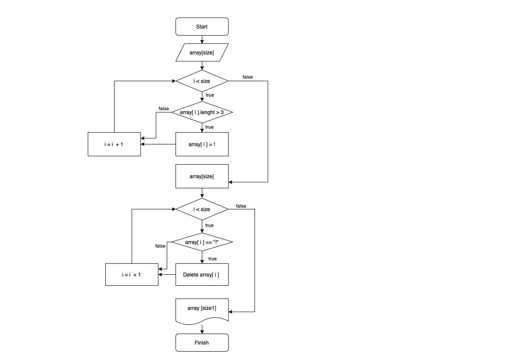

Задание. Написать программу, которая из имеющегося массива строк
сформирует массив из строк, длина которых меньше или равна трем символам.

Рисуем блок-схему.

Решение. Задаем и выводим массив, затем все строки исходного массива, длина которых больше трех символов заменяем на один символ воскличательного знака. Далее формируем новый массив путем исключения из исходного тех строк, значения которых равны восклицательному знаку.
